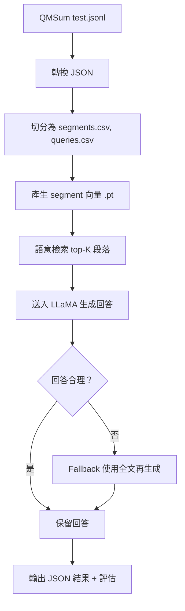

# 期末專案報告

本專案使用 Retrieval-Augmented Generation（RAG）技術實作一個問答系統，基於 QMSum 會議摘要資料集，結合 Sentence-BERT 向量檢索與 Meta LLaMA-3-8B-Instruct 語言模型生成答案，並支援 Fallback 策略以應對回答失效情況，最後以多種評估指標分析效果。

---

## 使用技術

| 模組 | 說明 |
|------|------|
| 向量檢索 | 使用 `BAAI/bge-base-en-v1.5` 建立段落 embedding |
| LLM 模型 | 使用 `meta-llama/Meta-Llama-3-8B-Instruct`（4-bit 量化）生成回答 |
| Fallback | 當前 top-K 段落回答無效時，自動 fallback 至全逐字稿內容再生成 |
| 評估指標 | F1、ROUGE-1/2/L、BERTScore、BARTScore |

---

## 系統流程

---

## 實驗結果（QMSum Test Set）

| 類別             | F1    | ROUGE-1 (F1) | ROUGE-2 (F1) | ROUGE-L (F1) | BERTScore (F1) | BARTScore |
|------------------|-------|---------------|---------------|---------------|----------------|-----------|
| 未使用 fallback | **22.11** | 28.90         | 7.25          | 19.06         | **85.92**      | -3.75     |
| 使用 fallback   | 20.59 | 28.23         | 6.45          | 18.20         | 84.96          | -3.78     |
| 全部             | 21.76 | 28.75         | 7.13          | 18.91         | 85.58          | -3.77     |

> **觀察：** Fallback 雖能補足部分失敗案例，但平均品質略低於原本 Top-K 片段所生成結果。經過比對，原因為這些問題是針對整個會議的內容進行QFS的摘要，問題是比較攏統的"Summarize the whole meeting."會使得容易觸發fallback。

---

## 結論與反思

- LLaMA-3 在回答基於 top-K 內容時表現良好，但對模糊或缺乏直接線索的 query 容易產生 `<<UNANSWERABLE>>`
- Fallback 策略在 recall 上有補強作用，但 precision 略降，造成 ROUGE 及 BARTScore 表現略下滑
- BERTScore 高達 85 分以上，代表語意對齊度仍不錯，但 BARTScore 偏低反映生成樣式與 reference 差距大

---

## 後續方向

- 嘗試不同檢索模型（如 Contriever, Cohere, hybrid TF-IDF）
- 多模型比較：Mistral 7B, Phi-3, OpenChat 3.5
- 強化 fallback 判斷邏輯，避免不必要 fallback 造成語義漂移

