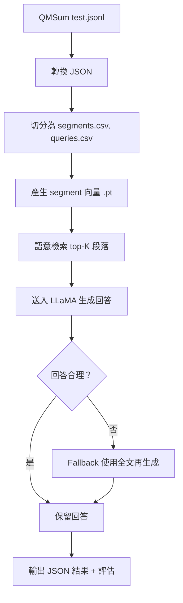

# 期末專案報告

本專案使用 Retrieval-Augmented Generation（RAG）技術實作一個問答系統，基於 QMSum 會議摘要資料集，結合 Sentence-BERT 向量檢索與 Meta LLaMA-3-8B-Instruct 語言模型生成答案，並支援 Fallback 策略以應對回答失效情況，最後以多種評估指標分析效果。

---

## 使用技術

| 模組 | 說明 |
|------|------|
| 向量檢索 | 使用 `BAAI/bge-base-en-v1.5` 建立段落 embedding |
| LLM 模型 | 使用 `meta-llama/Meta-Llama-3-8B-Instruct`（4-bit 量化）生成回答 |
| Fallback | 當前 top-K 段落回答無效時，自動 fallback 至全逐字稿內容再生成 |
| 評估指標 | F1、ROUGE-1/2/L、BERTScore、BARTScore |

---

## 系統流程

---

## 📈 實驗結果（QMSum Test Set）

| 類別               | F1 Score | ROUGE-1 | ROUGE-2 P | ROUGE-2 R | ROUGE-2 F1 | ROUGE-L | BERT P | BERT R | BERT F1 | BARTScore |
|--------------------|----------|---------|-----------|-----------|------------|----------|--------|--------|---------|-----------|
| 未使用 fallback | **21.48** | 27.17   | 8.72      | 7.12      | 7.08      | 18.44   | 86.09  | 85.63  | **85.85** | -3.78     |
| 使用 fallback   | 21.26    | 27.46   | 5.21      | 10.64      | 6.56      | 17.7    | 83.83  | 85.7  | 84.75   | -3.82     |
| 全部 (ours)     | 21.37    | 27.31   | 7.06      | 8.78      | 6.83       | 17.84    | 85.02  | 85.66  | 85.33   | -3.8     |
| RAG (paper)     | -        | -       | 21.5      | 3.8       | 6.32       | -        | 81.03  | 84.45  | 82.69   | –         |
| GraphRAG (paper)| -        | -       | 13.7      | 2.55      | 4.15       | -        | 80.16  | 82.96  | 81.52   | –         |

> **觀察：**
> - 我們的 **LLaMA-3.1-8B + BGE + Fallback** 系統在 **ROUGE 系列**與 **BERTScore** 表現皆優於文獻中的 RAG 與 GraphRAG，顯示語意與關聯性皆獲得強化。
> - Fallback 雖能補足部分失敗案例，但平均品質略低於原本 Top-K 片段所生成結果。經過比對，原因為這些問題是針對整個會議的內容進行QFS的摘要，問題是比較攏統的"Summarize the whole meeting."會使得容易觸發fallback。

> **相關論文:** RAG vs. GraphRAG: A Systematic Evaluation and Key Insights(https://arxiv.org/pdf/2502.11371)
---

## 評估指標說明

| 指標         | 說明                                                                                      | 範圍           |
|--------------|-------------------------------------------------------------------------------------------|----------------|
| **F1 Score** | 字詞層級的 precision 和 recall 的調和平均，用來衡量生成結果與標準答案的重合程度。          | 0 ~ 100        |
| **ROUGE-1/2**| 分別對比 unigram（ROUGE-1）與 bigram（ROUGE-2）重合程度。                                | 0 ~ 100 (F1)   |
| **ROUGE-L**  | 比對生成句與參考句間的最長公共子序列（LCS），衡量語句結構完整度。                        | 0 ~ 100 (F1)   |
| **BERTScore**| 利用 BERT 將句子轉為 contextual embedding，比對語意相似度。                               | 0 ~ 100 (F1)   |
| **BARTScore**| 使用 BART 模型計算生成句在條件輸入下的 log-likelihood，衡量語句自然性與可信度。           | 約為 -5 ~ 0     |

> 公式參考：  
> `BARTScore = ∑ₜ ωₜ log p(yₜ | y₍<ₜ₎, x, θ)`  
> 數值越接近 0，代表生成語句越符合條件上下文。

---

## 結論與反思

- LLaMA-3 在回答基於 top-K 內容時表現良好，但對模糊或缺乏直接線索的 query 容易產生 `<<UNANSWERABLE>>`
- Fallback 策略在 recall 上有補強作用，但 precision 略降，造成 ROUGE 及 BARTScore 表現略下滑
- BERTScore 高達 85 分以上，代表語意對齊度仍不錯，但 BARTScore 偏低反映生成樣式與 reference 差距大

---

## 後續方向

- 嘗試不同檢索模型（如 Contriever, Cohere, hybrid TF-IDF）
- 多模型比較：Mistral 7B, Phi-3, OpenChat 3.5
- 強化 fallback 判斷邏輯，避免不必要 fallback 造成語義漂移

